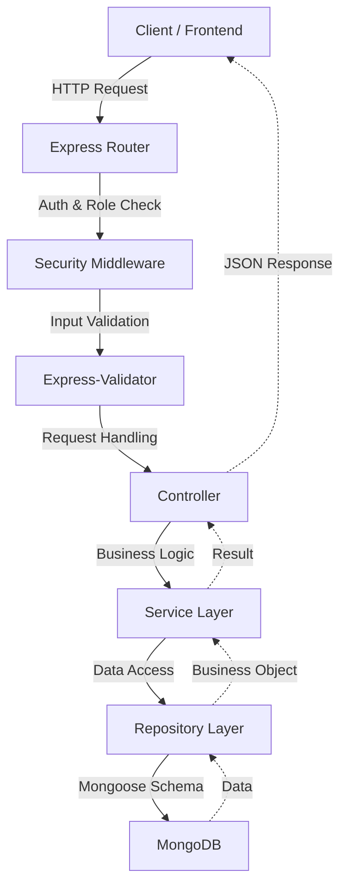

# Life-On-Land 🦁🐘


**Classification:** Public-SLIIT

Life-On-Land is a professional-grade **Poaching Alert and Wildlife Movement Tracking** system. It provides a robust backend infrastructure for monitoring wildlife, managing ranger patrols, assessing environmental risks, and detecting potential poaching incidents in real-time.

---

## 🏗️ System Architecture

The project is built using a **Layered Architecture** with the **Service-Repository Pattern**, ensuring a clean separation of concerns and high testability.

### Request-Response Flow


### Folder Responsibilities
- **`config/`**: Database and environment configurations.
- **`routes/`**: API endpoint definitions and middleware mapping.
- **`controllers/`**: HTTP logic, status codes, and response formatting.
- **`services/`**: Complex business rules and cross-module logic.
- **`repositories/`**: Raw database interactions (Mongoose queries).
- **`models/`**: Data schemas and entity definitions.
- **`middleware/`**: Auth, Authorization, and Global Error Handling.
- **`validators/`**: Request body and query parameter requirements.
- **`scripts/`**: Automation and simulation utilities.

---

## 🚀 Setup Instructions

### 1. Prerequisites
- **Node.js**: v18.x or higher
- **MongoDB**: v6.0 or higher (Local or Atlas)
- **Git**: For version control

### 2. Installation
```bash
# Clone the repository
git clone <repository-url>
cd Life-On-Land

# Install dependencies
cd backend
npm install
```

### 3. Environment Configuration
Create a `.env` file in the `backend/` directory:
```env
PORT=5001
MONGO_URI=mongodb+srv://<user>:<password>@cluster.mongodb.net/life-on-land
JWT_SECRET=your_super_secret_key_change_this_regularly
JWT_EXPIRES_IN=7d
NODE_ENV=development
```

### 4. Running the Application
```bash
# Development mode (with Hot Reload)
npm run dev

# Production mode
npm start
```
The API is served at `http://localhost:5001/api`.

### 5. Running the Movement Simulator
To simulate real-time animal tracking data:
```bash
npm run simulate
```

---

## 🔑 API Endpoint Documentation

### 🛡️ Authentication
| Method | Endpoint | Description | Auth Req. |
| :--- | :--- | :--- | :--- |
| `POST` | `/api/auth/register` | Register a new Ranger/Admin | None |
| `POST` | `/api/auth/login` | Login and receive JWT/Cookie | None |
| `POST` | `/api/auth/logout` | Clear authentication state | None |

### 🐾 Animal Management
| Method | Endpoint | Description | Roles |
| :--- | :--- | :--- | :--- |
| `GET` | `/api/animals` | List animals (Paginated + Filters) | RANGER, ADMIN |
| `POST` | `/api/animals` | Register a new animal with TagId | ADMIN |
| `GET` | `/api/animals/:tagId` | Get detailed animal profile | RANGER, ADMIN |
| `PUT` | `/api/animals/:tagId` | Update animal status/details | ADMIN |
| `DELETE` | `/api/animals/:tagId` | Soft delete an animal | ADMIN |

### 📍 Movement Tracking (Real-time)
| Method | Endpoint | Description | Auth Req. |
| :--- | :--- | :--- | :--- |
| `POST` | `/api/movements` | Ingest bulk/single GPS data | None (IoT Device) |
| `GET` | `/api/movements/:tagId` | Get movement history for animal | JWT |
| `GET` | `/api/movements/summary` | Get latest location for all animals | JWT |

### 🛡️ Patrol Management
| Method | Endpoint | Description | Roles |
| :--- | :--- | :--- | :--- |
| `POST` | `/api/patrols` | Schedule a new patrol route | ADMIN |
| `GET` | `/api/patrols` | List active/past patrols | RANGER, ADMIN |
| `POST` | `/api/patrols/:id/check-ins` | Log a location check-in | RANGER |

### 🚨 Incident Reporting
| Method | Endpoint | Description | Roles |
| :--- | :--- | :--- | :--- |
| `POST` | `/api/incidents` | Report a poaching/habitat threat | ANY (Verified) |
| `GET` | `/api/incidents` | Search and filter incidents | RANGER, ADMIN |
| `PUT` | `/api/incidents/:id` | Update severity/status | RANGER, ADMIN |

### 🌍 Risk Assessment & Zones
| Method | Endpoint | Description | Roles |
| :--- | :--- | :--- | :--- |
| `GET` | `/api/risk-map` | Get risk scores based on history | ADMIN |
| `GET` | `/api/protected-areas` | List conservation areas | ALL |
| `POST` | `/api/protected-areas` | Create new area/boundary | ADMIN |

---

## 🔮 Future Developments

### 1. Deployment Report
Planned integration with **AWS (EC2/Lambda)** and **MongoDB Atlas** for high availability. We aim to implement **Docker** containerization for consistent environment scaling.

### 2. Testing Instruction Report
A comprehensive testing suite is in development using **Jest** and **Supertest**. 
- **Unit Tests**: Coverage for individual services and repositories.
- **Integration Tests**: End-to-end API flow validation.
- **Performance Tests**: Stress testing for movement ingestion (1000+ data points/sec).

### 3. React Frontend
A modern dashboard built with **React, Tailwind CSS, and Leaflet.js** is planned to visualize animal movements on interactive maps, provide heatmaps for risk zones, and manage ranger assignments through a GIS-based interface.

---

## 🛠️ Built With
- **Node.js & Express** - Scalable backend framework.
- **Mongoose** - Advanced MongoDB data modeling.
- **JWT & Bcrypt** - Secure authentication and password hashing.
- **Express-Validator** - Robust input sanitization.
- **Mermaid.js** - Dynamic architectural diagrams.

---
**Life-On-Land** - *Protecting our natural heritage through technology.*
