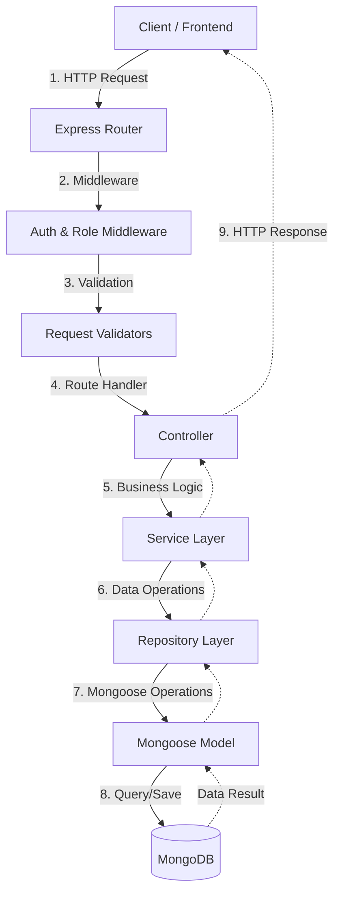

# Life-On-Land 🦁🐘

**Classification:** Public-SLIIT

Life-On-Land is a Poaching Alert and Wildlife Movement Tracking application. It is designed to assist authorities and rangers in monitoring wildlife movements and preventing illegal poaching activities. This project is developed as part of the Application Frameworks module at SLIIT.

---

## 🏗️ System Architecture

The project follows a **Layered Architecture** with the **Service-Repository Pattern** to ensure separation of concerns, maintainability, and scalability.

### Request-Response Flow


1.  **API Layer (Routes & Controllers):**
    *   **Routes:** Define the API endpoints and specify middleware (authentication, role-based access, validation).
    *   **Controllers:** Handle HTTP requests, extract data from the request object, and call the appropriate services.
2.  **Business Logic Layer (Services):**
    *   **Services:** Encapsulate core business logic, such as validation checks that depend on multiple resources and complex data transformations.
3.  **Data Access Layer (Repositories & Models):**
    *   **Repositories:** Abstract database operations. This allows the business logic to remain agnostic of the underlying database implementation.
    *   **Models:** Define the database schemas using Mongoose for MongoDB.

### Folder Responsibilities & Structure

The `backend` directory is organized into specific folders, each with a clear responsibility to maintain the Single Responsibility Principle:

*   **`config/`**: Contains configuration files, such as the database connection logic (`db.js`). Centralizes environment-dependent settings.
*   **`routes/`**: The entry point for all API requests. It maps URLs to specific controllers and attaches necessary middleware (like authentication or validation).
*   **`controllers/`**: Orchestrates the request-response cycle. It extracts data from the request, calls the appropriate Service, and sends the final HTTP response (e.g., `201 Created`).
*   **`services/`**: The "brain" of the application. Contains business logic that isn't specific to the database or the transport layer. For example, checking if a `tagId` is already in use before creating a new animal.
*   **`repositories/`**: Acts as a data access layer. It contains direct database operations using Mongoose methods (`find`, `findById`, `create`). This makes it easy to swap databases or unit test services.
*   **`models/`**: Defines the data structure (Schema) for MongoDB. It ensures data consistency and provides the Mongoose model objects.
*   **`middleware/`**: Functions that run "in the middle" of a request.
    *   `auth.middleware.js`: Verifies JWT tokens.
    *   `role.middleware.js`: Restricts access based on user roles (`ADMIN`, `RANGER`).
    *   `error.middleware.js`: Global error handling to catch and format server errors.
*   **`validators/`**: Contains logic to "sanitize" and validate incoming request data (body, query, params) before it reaches the controllers.
*   **`utils/`**: Reusable utility functions, such as JWT generation, custom error handling wrappers (`asyncHandler`), and complex query builders.

---

### Full Execution Flow (Example: Creating an Animal)

1.  **Incoming Request**: A client sends a `POST` request to `/api/animals`.
2.  **Routing**: `server.js` passes the request to `animal.route.js`.
3.  **Middleware & Security**:
    *   `protect` middleware verifies the user's JWT.
    *   `authorizeRoles("ADMIN")` ensures the user has permission.
4.  **Validation**: `validateCreateAnimal` checks if the body has a valid `tagId`, `species`, etc.
5.  **Controller**: `animal.controller.js` receives the sanitized data. It calls `animalService.createAnimal()`.
6.  **Business Logic**: `animal.service.js` checks if an animal with that `tagId` already exists via the repository.
7.  **Data Access**: If valid, `animal.repository.js` calls `Animal.create()` to save it to MongoDB.
8.  **Final Response**: The Controller sends a `201` status back to the client with the created animal data.

---

**Tech Stack:**
*   **Backend:** Node.js, Express.js
*   **Database:** MongoDB with Mongoose
*   **Authentication:** JSON Web Token (JWT) with HTTP-only Cookies and Bearer Header support.

---

## 🚀 Setup Instructions

Follow these steps to get the project running locally:

### Prerequisites
*   [Node.js](https://nodejs.org/) (v16+ recommended)
*   [MongoDB](https://www.mongodb.com/try/download/community) (Local or Atlas instance)

### Installation

1.  **Clone the Repository:**
    ```bash
    git clone <repository-url>
    cd Life-On-Land
    ```

2.  **Setup Backend:**
    ```bash
    cd backend
    npm install
    ```

3.  **Configure Environment Variables:**
    Create a `.env` file in the `backend` directory and add your credentials (refer to `.env.example`):
    ```env
    PORT=5001
    MONGO_URI=your_mongodb_connection_string
    JWT_SECRET=your_jwt_secret_key
    JWT_EXPIRES_IN=7d
    NODE_ENV=development
    ```

4.  **Run the Application:**
    ```bash
    # For development (with nodemon)
    npm run dev

    # For production
    npm start
    ```
    The server should now be running on `http://localhost:5001`.

---

## 🔑 API Endpoint Documentation

### Authentication
Most endpoints require authentication. You can authenticate by:
1.  Providing a `Bearer <token>` in the `Authorization` header.
2.  Using the `jwt` cookie set automatically upon login.

#### 1. Register User
*   **Endpoint:** `POST /api/auth/register`
*   **Method:** `POST`
*   **Auth Required:** No
*   **Request Body:**
    ```json
    {
      "name": "John Doe",
      "email": "john@example.com",
      "password": "Password123",
      "role": "RANGER"
    }
    ```
*   **Success Response (201):**
    ```json
    {
      "message": "User registered successfully",
      "_id": "...",
      "name": "John Doe",
      "email": "john@example.com",
      "role": "RANGER"
    }
    ```

#### 2. Login User
*   **Endpoint:** `POST /api/auth/login`
*   **Method:** `POST`
*   **Auth Required:** No
*   **Request Body:**
    ```json
    {
      "email": "john@example.com",
      "password": "Password123"
    }
    ```
*   **Success Response (200):** Sets a `jwt` cookie.

#### 3. Logout User
*   **Endpoint:** `POST /api/auth/logout`
*   **Method:** `POST`
*   **Auth Required:** No
*   **Response (200):** Clears the `jwt` cookie.

### Animal Management

#### 4. Create Animal
*   **Endpoint:** `POST /api/animals`
*   **Method:** `POST`
*   **Auth Required:** Yes (Role: `ADMIN`)
*   **Request Body:**
    ```json
    {
      "tagId": "ELE-001",
      "species": "Elephant",
      "sex": "MALE",
      "ageClass": "ADULT",
      "protectedAreaId": "65d... (Valid ObjectId)",
      "status": "ACTIVE"
    }
    ```
*   **Success Response (201):**
    ```json
    {
      "message": "Animal registered",
      "animal": { ... }
    }
    ```

#### 5. Get All Animals (with Pagination)
*   **Endpoint:** `GET /api/animals`
*   **Method:** `GET`
*   **Auth Required:** Yes (Role: `ADMIN`, `RANGER`)
*   **Query Parameters:**
    *   `page`: Page number (default: 1)
    *   `limit`: Items per page (default: 10)
    *   `species`: Filter by species
    *   `status`: Filter by status (`ACTIVE`, `INACTIVE`, etc.)
*   **Success Response (200):**
    ```json
    {
      "data": [...],
      "pagination": {
        "total": 100,
        "page": 1,
        "limit": 10,
        "pages": 10
      }
    }
    ```

#### 6. Get Animal by ID
*   **Endpoint:** `GET /api/animals/:id`
*   **Method:** `GET`
*   **Auth Required:** Yes (Role: `ADMIN`, `RANGER`)
*   **Success Response (200):** `{ "animal": { ... } }`

#### 7. Update Animal
*   **Endpoint:** `PUT /api/animals/:id`
*   **Method:** `PUT`
*   **Auth Required:** Yes (Role: `ADMIN`)
*   **Request Body:** (Any subset of animal fields)
*   **Success Response (200):** `{ "message": "Animal updated", "animal": { ... } }`

#### 8. Delete Animal
*   **Endpoint:** `DELETE /api/animals/:id`
*   **Method:** `DELETE`
*   **Auth Required:** Yes (Role: `ADMIN`)
*   **Success Response (200):** `{ "message": "Animal deleted permanently" }`

---

## 🛠️ Built With
*   **Express.js** - Web framework
*   **Mongoose** - MongoDB object modeling
*   **JSON Web Token** - Authentication
*   **Bcryptjs** - Password hashing
*   **Express-validator** - Input validation
