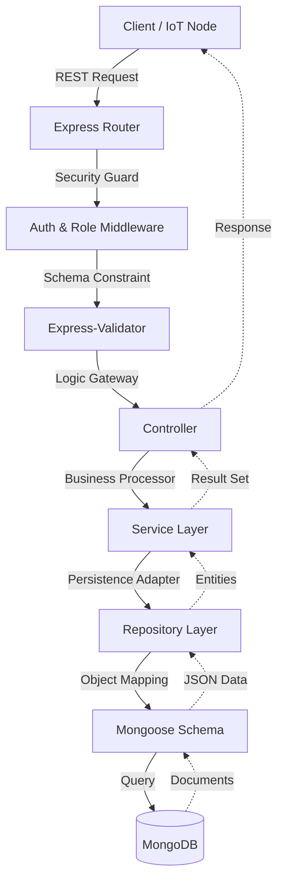

# Life-On-Land 🦁🐘

[](https://nodejs.org/)
[](https://expressjs.com/)
[](https://www.mongodb.com/)
[](https://jwt.io/)


Life-On-Land is a state-of-the-art **Poaching Alert and Wildlife Movement Tracking** system designed to protect biodiversity. It provides a highly scalable backend for real-time wildlife monitoring, ranger coordination, and proactive threat detection.

---

## ✨ Key Features

- 🛰️ **Real-time GPS Tracking**: High-throughput ingestion of animal movement data via IoT devices.
- 🚨 **Automated Alert System**: Immediate notification triggers for poaching incidents and boundary breaches.
- 🛡️ **Advanced Patrol Management**: Dynamic scheduling, geo-fenced check-ins, and digital logbooks for rangers.
- 📈 **Risk Mapping**: Heatmap-based risk assessment utilizing historical incident and movement data.
- 🔒 **RBAC Security**: Granular Role-Based Access Control (ADMIN, OFFICER, RANGER).
- 🧬 **Data Integrity**: Robust validation and sanitization for all incoming data streams.

---

## 🏗️ System Architecture

The system utilizes a **Layered Architecture** with a **Service-Repository Pattern**, maximizing decoupling and maintainability.

### Request-Response Flow


### Component Hierarchy
- `config/`: System orchestration & DB connectivity.
- `routes/`: API topology and routing logic.
- `controllers/`: Request handling and response shaping.
- `services/`: Core business logic and inter-module coordination.
- `repositories/`: Optimized data access layer.
- `models/`: Strictly typed Mongoose schemas.
- `middleware/`: Security, Authorization, and Centralized Logging.
- `validators/`: Strict input validation rules.
- `utils/`: For helper functions

---

## 🚀 Getting Started

### 1. Prerequisites
- **Node.js**: v18.x+
- **MongoDB**: v6.0+ (Local or Atlas)

### 2. Installation
```bash
# Clone the repository
git clone https://github.com/RUSIRUDEVINDA/Life-On-Land.git
cd Life-On-Land/backend

# Install dependencies
npm install
```

### 3. Setup Environment
Rename `.env.example` to `.env` and fill in your credentials:
```env
PORT=5001
MONGO_URI=your_mongodb_uri
JWT_SECRET=your_complex_secret
JWT_EXPIRES_IN=7d
```

### 4. Launch
```bash
# Development (with hot-reload)
npm run dev

# Production
npm start
```

---

## 🔑 API Documentation

### 🛡️ Authentication (`/api/auth`)
| Endpoint | Description | Roles |
| :--- | :--- | :--- |
| `POST /api/auth/register` | Register a new user | Public |
| `POST /api/auth/login` | Authenticate and obtain access credentials | Public |
| `POST /api/auth/logout` | Invalidate current session | Public |

### 👤 User Management (`/api/users`)
| Endpoint | Description | Roles |
| :--- | :--- | :--- |
| `GET /api/users` | List all users (Filters: `name`, `email`, `role`, `page`, `limit`) | ADMIN, RANGER |
| `GET /api/users/:id` | Get specific user profile | ANY (Authenticated) |
| `PUT /api/users/:id` | Full user update | ANY (Owner/Admin) |
| `PATCH /api/users/:id` | Partial user update | ANY (Owner/Admin) |
| `DELETE /api/users/:id` | Terminate user account | ADMIN |

### 🐾 Animal Registry (`/api/animals`)
| Endpoint | Description | Roles |
| :--- | :--- | :--- |
| `GET /api/animals` | List animals (Paginated + Filter by `species`, `status`, etc.) | ADMIN, RANGER |
| `POST /api/animals` | Register new animal (Tag ID required) | ADMIN |
| `GET /api/animals/:tagId` | Retrieve detailed animal profile | ADMIN, RANGER |
| `PUT /api/animals/:tagId` | Full profile replacement | ADMIN |
| `PATCH /api/animals/:tagId` | Partial profile update | ADMIN |
| `DELETE /api/animals/:tagId` | Remove animal record | ADMIN |

### 📡 Movement Tracking (`/api/movements`)
| Endpoint | Description | Roles |
| :--- | :--- | :--- |
| `POST /api/movements` | Ingest movement data (IoT/Manual) | Public (IoT) |
| `GET /api/movements` | Search movement logs | ADMIN, RANGER |
| `GET /api/movements/summary` | Latest location snapshot for all animals | ADMIN, RANGER |
| `GET /api/movements/:tagId` | Historical movements by Tag ID | ADMIN, RANGER |

### 🛡️ Patrol Operations (`/api/patrols`)
| Endpoint | Description | Roles |
| :--- | :--- | :--- |
| `POST /api/patrols` | Schedule new patrol | ADMIN |
| `GET /api/patrols` | List patrols (Filters: `rangerId`, `status`, `from`, `to`) | ADMIN, RANGER |
| `GET /api/patrols/:id` | Get specific patrol details | ADMIN, RANGER |
| `PUT /api/patrols/:id` | Full patrol update (Replace) | ADMIN |
| `PATCH /api/patrols/:id` | Partial patrol update | ADMIN |
| `DELETE /api/patrols/:id` | Cancel/Remove patrol | ADMIN |
| `POST /api/patrols/:id/check-ins` | Record ranger check-in | RANGER |
| `GET /api/patrols/:id/check-ins` | View patrol check-in history | ADMIN, RANGER |
| `PUT /api/patrols/:id/check-ins/:cid` | Correct check-in log (Full) | RANGER |
| `PATCH /api/patrols/:id/check-ins/:cid` | Correct check-in log (Partial) | RANGER |
| `DELETE /api/patrols/:id/check-ins/:cid` | Remove check-in record | RANGER |

### 🚨 Incident Reporting (`/api/incidents`)
| Endpoint | Description | Roles |
| :--- | :--- | :--- |
| `POST /api/incidents` | Report threat (POACHING, LOGGING, etc.) | Public/Guest |
| `GET /api/incidents` | Query incidents (Filters: `type`, `status`, `severity`, `date`) | ADMIN, RANGER, OFFICER |
| `GET /api/incidents/:id` | Get full investigation report | ADMIN, RANGER, OFFICER |
| `PUT /api/incidents/:id` | Update status/severity | ADMIN, RANGER, OFFICER |
| `DELETE /api/incidents/:id` | Soft delete record | ADMIN |

### 🔔 Smart Alerts (`/api/alerts`)
| Endpoint | Description | Roles |
| :--- | :--- | :--- |
| `GET /api/alerts` | List triggered alerts | ADMIN |
| `PATCH /api/alerts/:id` | Acknowledge or Resolve alert | ADMIN |

### 🗺️ Conservation Geometry (`/api/protected-areas`)
| Endpoint | Description | Roles |
| :--- | :--- | :--- |
| `GET /api/protected-areas` | List conservation areas | Public |
| `POST /api/protected-areas` | Create new area boundary | ADMIN |
| `GET /api/protected-areas/:id` | Get area details | Public |
| `PUT /api/protected-areas/:id` | Update area metadata | ADMIN |
| `DELETE /api/protected-areas/:id` | Remove protected area | ADMIN |
| `GET /api/protected-areas/:id/zones` | List zones in specific area | Public |
| `POST /api/protected-areas/:id/zones` | Create zone (Risk Level) | ADMIN |

### 📍 Zone Management (`/api/zones`)
| Endpoint | Description | Roles |
| :--- | :--- | :--- |
| `PUT /api/zones/:id` | Update zone properties | ADMIN |
| `DELETE /api/zones/:id` | Remove zone permanently | ADMIN |

### 📊 Risk Intelligence (`/api/risk-map`)
| Endpoint | Description | Roles |
| :--- | :--- | :--- |
| `GET /api/risk-map` | Generate area-based risk heatmap data | ADMIN, RANGER |

---

## 🛠️ Tech Stack
- **Backend**: Node.js, Express.js
- **Database**: MongoDB & Mongoose ODM
- **Security**: JWT, Bcrypt, Role-Based Access Control
- **Validation**: Custom Validators
- **Documentation**: Mermaid.js, Markdown

---
**Life-On-Land** - *Empowering wildlife protection through engineering.*
